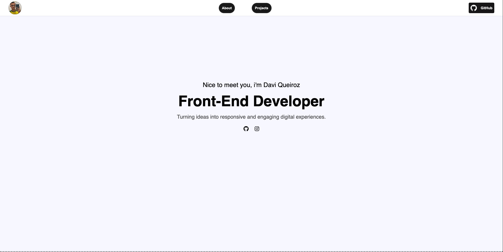
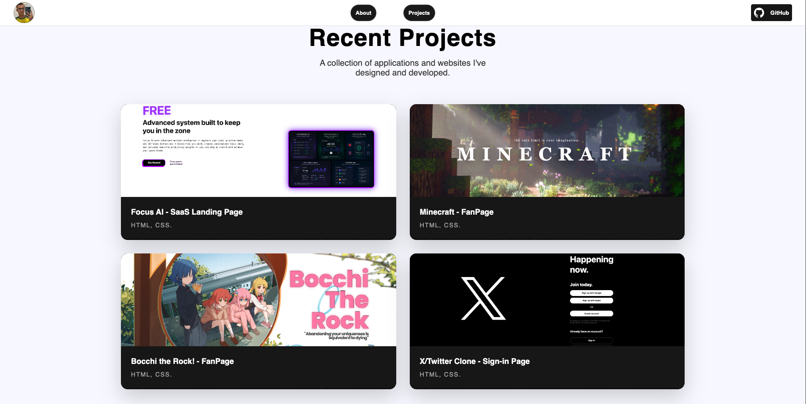
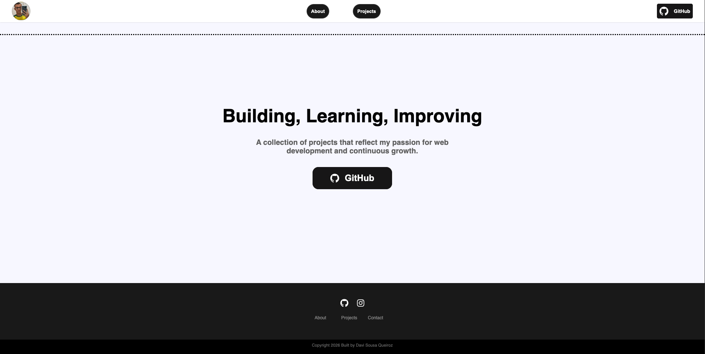
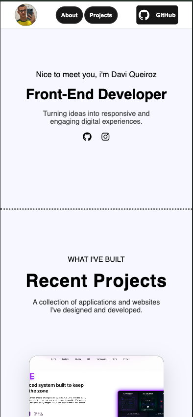
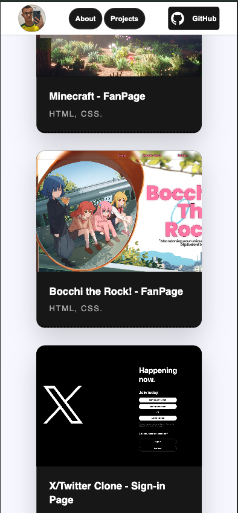
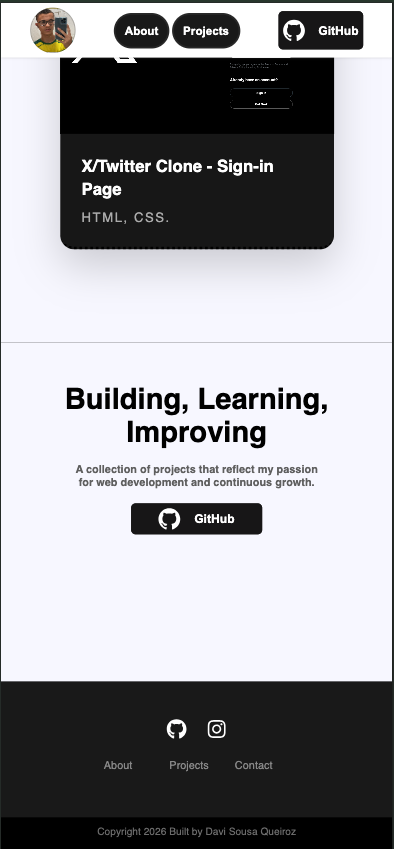

# 💼 Personal Portfolio (June 8th 2026)

A clean and responsive portfolio website built with HTML and CSS to showcase my projects, frontend skills, and development journey.

After spending several days building Focus AI (and questioning my life choices multiple times), I wanted something smaller to practice responsive design.

The original plan was simple:

“Just build a quick portfolio.”

As usual, that somehow turned into another late-night coding session.

This portfolio features some of my favorite frontend projects so far, including Focus AI, my Minecraft Fanpage, Bocchi The Rock Fanpage, and an X/Twitter sign-in page clone.

Unlike a real portfolio, this one wasn’t built to get hired.

It was built to learn.

More specifically:

It was built because I kept avoiding media queries.

And eventually the media queries won.

## 🔗 Live Demo:
https://davi-sousa-queiroz.github.io/personal-portfolio-sample/

## 📸 Preview

### 🖥️ Desktop Version

### 📱 Mobile Version

## ✨ Features

### 👋 Hero Section

* Personal introduction
* Social media links
* Clean and minimal design
* Responsive typography

### 🚀 Projects Showcase

* Four featured projects
* Project preview cards
* Direct links to live demos
* Responsive grid layout

### 📱 Responsive Design

* Mobile-first improvements
* Media queries for tablets and desktops
* Flexible layouts
* Consistent spacing across devices

### 🎨 Visual Design

* Modern monochrome theme
* Hover effects
* Smooth transitions
* Card-based project layout
* Fixed navigation bar

### 🦶 Footer

* Quick navigation links
* Social media links
* Clean and minimal structure

⸻

## 🛠️ Built With

* HTML5
* CSS3
* Flexbox
* CSS Grid
* Media Queries
* CSS Transitions
* Git
* GitHub Pages

⸻

## 📚 What I Learned

This project was mostly about one thing:

Responsive design.

For weeks I’d been building websites that looked great on my monitor and then immediately fell apart on smaller screens.

This was the first project where I actually sat down and properly worked with media queries.

During development I practiced:

* Responsive layouts
* Media queries
* CSS Grid
* Flexbox
* Better spacing decisions
* Mobile-first thinking
* Structuring larger HTML files
* Organizing CSS more effectively

Most importantly, I learned that responsive design isn’t some scary advanced topic.

It’s just another problem to solve.

⸻

## 📈 Project Stats

* ⏱️ Built in one extremely long night
* ☕ Dangerous amounts of caffeine involved
* 😴 Sleep schedule temporarily deleted
* 📱 First fully responsive website
* 🎨 Countless spacing adjustments
* 🚀 One step closer to a real portfolio

⸻

## 🚀 Future Improvements

* Add JavaScript interactions
* Create a dedicated skills section
* Add project source code links
* Improve accessibility
* Add contact form functionality
* Create an actual professional portfolio later

⸻

## 💭 Note To Future Me

Hey future Davi,

This wasn’t supposed to be an all-nighter.

Again.

The goal was simply to practice responsive design and finally stop avoiding media queries.

Somewhere around 11:30 PM, that plan stopped existing.

By sunrise, the portfolio was finished.

Looking back, I hope this project reminds you of something:

Progress isn’t always measured by how impressive a project is.

Sometimes it’s measured by finally learning the thing you’ve been putting off.

This wasn’t your biggest project.

Focus AI was bigger.

But this was the project where responsive design finally clicked.

And that’s worth remembering.

Keep building.

Keep learning.

And maybe start projects before midnight.

— Davi 🧑‍💻
